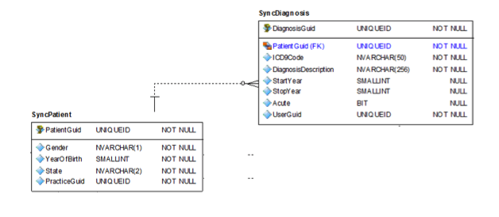

```{r setup, include=FALSE}
knitr::opts_chunk$set(echo = TRUE)
knitr::opts_knit$set(root.dir="~/Documents/introdatascience")
```

## Introduction
Electronic Medical Records (EMRs) can serve as a rich source of patient data, with which to construct predictive models for disease.  Type 2 Diabetes accounts for 90-95% of all diabetes cases, with 23 million diagnosed cases among adults and 7.2 million undiagnosed cases in the United States as of 2015. [ref1](1) Predictive models can provide a means to identify undiagnosed or at risk individuals for Type 2 Diabetes.  This project develops and evaluates predictive models for identifying patients with diabetes using an EMR dataset.

## Data
The project makes use of a 2012 EMR data set of approx. 10,000 patients, taken from a Kaggle competition [ref2](2).  The data set consists of sql tables for patients, allergies, diagnoses, and prescriptions, as well as tables for transcripts of visit data and labs. Figure 1 shows the relationship diagram between the Patient and Diagnoisis tables.  Although all data relating to Type 2 Diabetes has been scrubbed from the dataset, patients diagnosed with Type 2 Diabetes are identified using an indicator in the patient table (not shown in the ER diagram). The full ER Diagram is available in Appendix A.  Tables of interest are described below.




### Patient Table
The patient table contains an indicator field to identify the diabetic population, as well as the patient's gender and year of birth

### Allergy Table
The allergy table contains a field for allergy type to identify the category of allergy, as well as for reaction name for the type of reaction and severity name for the severity of the allergic reaction.  The allergy table also contains a field for medication ndc codes to map medication allergies to a specific medication.

### Diagnosis Table
The diagnosis table contains the ICD9 Code to specifically identify the diagnosis, as well as an Acute indicator to flag acute instances of a diagnosis.  Although there is a diagnosis description field, its contents are not standardized and thus not suitable for analysis.  Instead, the ICD9 codes can be mapped to names from a table available online: [List of ICD-9 Codes](https://en.wikipedia.org/wiki/List_of_ICD-9_codes).

### Medication Table
The medication table contains the NdcCode field, which specifically identifies medications, as well as the Medication Name.

### Transcript Table
The transcript table contains fields for height, weight, BMI, SystolicBP, DiastolicBP, respiratory rate, heart rate, and temperature.

### Lab Observation Table
The lab observation table contains values from a variety of labs identified by an HL7 identifier.  The text for these is more standardized and can be used to identify the type of lab the observations are for.  The observation value and units fields provide the actual measurement values.  There is an identifier for abnormal values as well as an abnormal flags field which indicates whether the abnormal value is high or low and to what degree.

### Other Tables
There was insufficient data in the Immunization and Smoking tables for meaningful analysis. For the sake of simplicity, medication analysis was limited to the type of medication, so the prescription data was not analyzed. The condition table shown in the ER diagram was not included in the dataset. 


## Data Cleaning
Prior to analysis, the data included in the dataset required significant cleaning.  The steps taken to clean the data are detailed below.

The raw data was contained in Comma Separated Values (CSV) files, one for each table.  Each file was loaded into a separate data frame using read_csv().  Relevant fields were selected using select(). The example below shows the patient and diagnosis table files being read into data frames.

```{r eval = FALSE}
# read patient table into data frame.
patient <- read_csv("db/training_patient.csv") %>%
  select(-PracticeGuid)

# read diagnosis table into data frame.  
diagnosis <- read_csv("db/training_diagnosis.csv") %>%
  select(DiagnosisGuid, DiagnosisDescription, PatientGuid, ICD9Code, StartYear, StopYear, Acute)
```

Since data was spread across different tables, the corresponding data frames needed to be joined in order to pull the data together into a single data frame.

```{r eval=FALSE}
# allergy data frame
patientAllergy <- inner_join(
  patient %>% select(PatientGuid, dmIndicator, diabetesStatus),
  allergy
)

# diagnosis data frame
patientDiagnosis <- inner_join(
  patient %>% select(PatientGuid, dmIndicator, diabetesStatus),
  diagnosis
)
```

Some of the data had too much differentiation and needed to be chunked in order to be analyzed.  For example, the diagnoses were chunked into categories based on ICD-9 Code ranges.

```{r eval=FALSE}
# create diagCat column in patientDiagnosis containing diagnosis categories corresponding to ranges of ICD9 Codes
diagnosis$diagCat <-
  ifelse((as.integer(diagnosis$ICD9Code) < 140), 
    "Infectious/Parasitic",
    ifelse((as.integer(diagnosis$ICD9Code) >= 140 &
      as.integer(diagnosis$ICD9Code) < 240), 
      "Neoplasms",
      ifelse((as.integer(diagnosis$ICD9Code) >=240 &
        as.integer(diagnosis$ICD9Code) < 280),
          "Endocrine/Nutritional/Metabolic",
          ...
```

Another instance where there was simply too much data to analyze is for medication allergies. Since there is no readily available resource to map the codes into categories of medicine, a data frame was created that maps the code to the medication name for display purposes.

```{r eval = FALSE}
# create medicationMap data frame linking medication names to their NDC Codes
medicationMap <- medication %>% select(MedicationNdcCode, MedicationName) %>%
  group_by(MedicationNdcCode) %>% distinct(MedicationName) %>%
  arrange(MedicationNdcCode)
```

The top medication allergies were identified by sorting them by number of instances and filtering out the medications for which fewer than 20 diabetic patients have allergies.

```{r eval=FALSE}
# identify the medications for which at least 20 patients have allergies
topAllergyNdcCodes <- diabeticAllergyMeds %>%
  group_by(AllergyMedicationNdcCode) %>% 
  summarise(n = n()) %>%
  ungroup() %>%
  filter(n >= 20) %>%
  select(AllergyMedicationNdcCode)
```

Some data needed to be transformed into appropriate data types, filtered to remove outliers and apparent data errors (impossible values, etc.), and derived.  The following example transforms several data fields in the transcript table into numeric values, filters out NA and negative values, and derives the pulse pressure from the systolic and diastolic values.

```{r eval=FALSE}
# change transcript Height & Weight to numeric types
transcript <- transform(transcript, Height = as.numeric(Height), 
                Weight = as.numeric(Weight), Temperature = as.numeric(Temperature),
                RespiratoryRate = as.numeric(RespiratoryRate), HeartRate = as.numeric(HeartRate), 
                SystolicBP = as.numeric(SystolicBP), DiastolicBP = as.numeric(DiastolicBP))
  
# add pulsePressure column to transcript (SystolicBP - DiastolicBP)
transcript <- transcript %>%
  filter(!is.na(SystolicBP)) %>% filter(!is.na(DiastolicBP)) %>% 
  filter(SystolicBP > 0 & DiastolicBP > 0) %>%
  mutate(pulsePressure = SystolicBP - DiastolicBP)

```

```{r include = FALSE}
library(tidyr)
library(dplyr)
library(dbplyr)
library(readr)
library(ggplot2)
library(Hmisc)
library(caTools)
library(mice)
library(ROCR)
library(ISLR)
library(boot)
library(caret)
library(randomForest)

# read patient table into data frame.
patient <- read_csv("db/training_patient.csv") %>%
  select(-PracticeGuid)

# read diagnosis table into data frame.  
diagnosis <- read_csv("db/training_diagnosis.csv") %>%
  select(DiagnosisGuid, DiagnosisDescription, PatientGuid, ICD9Code, StartYear, StopYear, Acute)

# read allergy table into data frame. Change column name of MedicationNdcCode to AllergyMedicationNdcCode to diambiguate between medication allergies and prescriptions.
allergy <- read_csv("db/training_allergy.csv") %>%
  select(AllergyGuid, PatientGuid, AllergyType, AllergyStartYear = StartYear, ReactionName, SeverityName, AllergyMedicationNdcCode = MedicationNdcCode)

# read medication table into data frame.
medication <- read_csv("db/training_medication.csv") %>%
  select(MedicationGuid, PatientGuid, MedicationNdcCode, MedicationName, MedicationStrength, Schedule, DiagnosisGuid)

# read prescription table into data frame.
prescription <- read_csv("db/training_prescription.csv") %>%
  select(PrescriptionGuid, PatientGuid, MedicationGuid, PrescriptionYear, Quantity, GenericAllowed)

# read immunization table into data frame.
immunization <- read_csv("db/training_immunization.csv") %>%
  select(ImmunizationGuid, PatientGuid, VaccineName, AdministeredYear, CvxCode)

# read lab tables into data frames.
labResult <- read_csv("db/training_labResult.csv") %>%
  select(LabResultGuid,PatientGuid, TranscriptGuid)

labPanel <- read_csv("db/training_labPanel.csv") %>%
  select(LabResultGuid, LabPanelGuid, PanelName)

labObservation <- read_csv("db/training_labObservation.csv")


# read transcript table into data frame.
transcript <- read_csv("db/training_transcript.csv") %>%
  select(TranscriptGuid, PatientGuid, VisitYear, Height, Weight, BMI, SystolicBP, DiastolicBP, RespiratoryRate, HeartRate, Temperature)

# read smoke table into data frame.
smoke <- read_csv("db/training_smoke.csv") %>%
  select(PatientGuid, SmokeEffectiveYear, SmokingStatus_Description, SmokingStatus_NISTCode)

#read join tables into data frames.
transDiag <- read_csv("db/training_transcriptDiagnosis.csv")
transMed <- read_csv("db/training_transcriptMedication.csv")
transAllergy <- read_csv("db/training_transcriptAllergy.csv")

# add age column to patient data frame: derived from subtracting 2010, the median year of the patient data (range: 2009 - 2012)
patient <- patient %>% mutate(age = 2010 - YearOfBirth)

# add daibetesStatus column to patient data frame for display in graphs.
patient$diabetesStatus <- ifelse(patient$dmIndicator, "Diabetic", "NonDiabetic")

# change type of AllergyMedicationNdcCode column to character.
allergy <- transform(allergy, AllergyMedicationNdcCode = as.character(AllergyMedicationNdcCode))

# change transcript Height & Weight to numeric types
transcript <- transform(transcript, Height = as.numeric(Height), Weight = as.numeric(Weight), Temperature = as.numeric(Temperature), RespiratoryRate = as.numeric(RespiratoryRate), HeartRate = as.numeric(HeartRate), SystolicBP = as.numeric(SystolicBP), DiastolicBP = as.numeric(DiastolicBP))
  
# add pulsePressure column to transcript (SystolicBP - DiastolicBP)
transcript <- transcript %>%
  filter(!is.na(SystolicBP)) %>% filter(!is.na(DiastolicBP)) %>% filter(SystolicBP > 0 & DiastolicBP > 0) %>%
  mutate(pulsePressure = SystolicBP - DiastolicBP)

# create medicationMap data frame linking medication names to their NDC Codes
medicationMap <- medication %>% select(MedicationNdcCode, MedicationName) %>% group_by(MedicationNdcCode) %>% distinct(MedicationName) %>% arrange(MedicationNdcCode)

# create diagCat column in patientDiagnosis containing 
# diagnosis categories corresponding to ranges of ICD9 Codes
diagnosis$diagCat <-
  ifelse((as.integer(diagnosis$ICD9Code) < 140), 
    "Infectious/Parasitic",
    ifelse((as.integer(diagnosis$ICD9Code) >= 140 &
      as.integer(diagnosis$ICD9Code) < 240), 
      "Neoplasms",
      ifelse((as.integer(diagnosis$ICD9Code) >=240 &
        as.integer(diagnosis$ICD9Code) < 280),
          "Endocrine/Nutritional/Metabolic",
          ifelse((as.integer(diagnosis$ICD9Code) >= 280 &
            as.integer(diagnosis$ICD9Code) < 290),
            "Blood",
            ifelse((as.integer(diagnosis$ICD9Code) >= 290 &
              as.integer(diagnosis$ICD9Code) < 320),
              "Mental",
              ifelse((as.integer(diagnosis$ICD9Code) >= 320 &
                as.integer(diagnosis$ICD9Code) < 390),
                "Nervous",
                ifelse((as.integer(diagnosis$ICD9Code) >= 390 &
                  as.integer(diagnosis$ICD9Code) < 460),
                  "Circulatory",
                  ifelse((as.integer(diagnosis$ICD9Code) >= 460 &
                    as.integer(diagnosis$ICD9Code) < 520),
                    "Respiratory",
                    ifelse((as.integer(diagnosis$ICD9Code) >= 520 &
                      as.integer(diagnosis$ICD9Code) < 580),
                      "Digestive",
  ifelse((as.integer(diagnosis$ICD9Code) >= 580 &
    as.integer(diagnosis$ICD9Code) < 630), 
    "Genitourinary",
    ifelse((as.integer(diagnosis$ICD9Code) >= 630 &
      as.integer(diagnosis$ICD9Code) < 680), 
      "Pregnancy",
      ifelse((as.integer(diagnosis$ICD9Code) >=680 &
        as.integer(diagnosis$ICD9Code) < 710),
          "Skin",
          ifelse((as.integer(diagnosis$ICD9Code) >=710 &
            as.integer(diagnosis$ICD9Code) < 740),
            "Musculoskeletal",
            ifelse((as.integer(diagnosis$ICD9Code) >= 740 &
              as.integer(diagnosis$ICD9Code) < 760),
              "Congenital",
              ifelse((as.integer(diagnosis$ICD9Code) >= 760 &
                as.integer(diagnosis$ICD9Code) < 780),
                "Perinatal",
                ifelse((as.integer(diagnosis$ICD9Code) >= 780 &
                  as.integer(diagnosis$ICD9Code) < 800),
                  "Ill Defined", 
                  ifelse((as.integer(diagnosis$ICD9Code) >= 800),
                    "Injury/Poisoning", 
                    "NULL"
                    )
                  )
                )
            )
          )
      )
    )
  ))))))))))


# allergy data frame
patientAllergy <- inner_join(
  patient %>% select(PatientGuid, dmIndicator, diabetesStatus),
  allergy
)

# diagnosis data frame
patientDiagnosis <- inner_join(
  patient %>% select(PatientGuid, dmIndicator, diabetesStatus),
  diagnosis
)

# labs data frame
patientLabs <- inner_join(
  patient %>% select(PatientGuid, dmIndicator, diabetesStatus),
  left_join(
    left_join(
      labResult, 
      labPanel, 
      by="LabResultGuid"
      ),
    labObservation,
    by="LabPanelGuid"
  )
)

# prescription data frame
patientPrescription <- inner_join(
  patient %>% select(PatientGuid, dmIndicator, diabetesStatus),
  inner_join(
    prescription,
    medication
  )
)

# transcript data frame
patientTranscript <- inner_join(
  patient %>% select(PatientGuid, dmIndicator, diabetesStatus),
  transcript
)

# immunization data frame
patientImmunization <- inner_join(
  patient %>% select(PatientGuid, dmIndicator, diabetesStatus),
  immunization
)

# smoking data frame
patientSmoke <- inner_join(
  patient %>% select(PatientGuid, dmIndicator, diabetesStatus),
  smoke
)

# use inner join to filter patients to those 
# with medication allergies, and pull in the names for the medications
allergyMeds <- inner_join(patientAllergy,medicationMap, by = c("AllergyMedicationNdcCode" = "MedicationNdcCode"))

# identify the medications by name for which diabetic patients have allergies
diabeticMedNames <- allergyMeds %>% filter(dmIndicator == "1") %>% select(MedicationName) %>% distinct()

# use inner join to filter patients to those using the medications for which
# diabetic patients also have allergies (filter out all medication allergies
# for which diabetic patients do not have allergies)
diabeticAllergyMeds <- inner_join(allergyMeds,diabeticMedNames)

# identify the medications for which at least 20 patients have allergies
topAllergyNdcCodes <- diabeticAllergyMeds %>%
  group_by(AllergyMedicationNdcCode) %>% 
  summarise(n = n()) %>%
  ungroup() %>%
  filter(n >= 20) %>%
  select(AllergyMedicationNdcCode)

# use inner join to filter data to those medications for which at least 20 
# patients have allergies
diabeticAllergyMeds <- inner_join(allergyMeds,topAllergyNdcCodes)

# identify which medications are most used by diabetic patients in comparison to non-diabetic patients

# get a count of prescriptions for medications used by diabetic patients
diabeticMedicationList <- patientPrescription %>% filter(dmIndicator == 1) %>% group_by(MedicationName) %>% summarise(n = n()) %>% ungroup() %>% arrange(desc(n))

# join with a count of prescriptions for medications used by all patients
diabeticMedicationList <- inner_join(diabeticMedicationList, patientPrescription %>% group_by(MedicationName) %>% summarise(n = n()) %>% ungroup() %>% arrange(desc(n)), by="MedicationName")

# get the ratio between diabetic prescriptions and total prescriptions
diabeticMedicationList <- diabeticMedicationList %>%
  mutate(useRatio = n.x/n.y)

# had to tweak the filter to get a reasonably small set of the medications with the highest ratio of diabetic prescriptions with the highest number of overall prescriptions
topDiabeticMedicationList <- diabeticMedicationList %>% filter(n.y > 300 & useRatio > .3) %>% arrange(desc(useRatio))

# create a data frame limited to the top diabetic prescription list
topDiabeticPrescriptions <- inner_join(patientPrescription, topDiabeticMedicationList, by="MedicationName")

# sort the abnormal statuses in the labs data
patientLabs$AbnormalFlagsSorted = factor(patientLabs$AbnormalFlags, levels = rev(c("Panic Low", "Alert Low", "Below Normal Low", "NA", "Above Normal High", "Alert High", "Panic High", "Abnormal Result", "UKNOWN")))
```

## Statistical Evaluation of the EMR Dataset
Once the data was imported and cleaned, initial exploratory analysis could be performed.  To start with, as a baseline comparison between the diabetic and non-diabetic patient populations in the dataset, 81% of the overall population is identified as non-diabetic and 19% is identified as diabetic.

```{r echo = FALSE, message = FALSE, warning = FALSE, fig.height = 3}
ggplot(patient, aes(x=factor(diabetesStatus, levels = c("NonDiabetic","Diabetic")), fill=factor(diabetesStatus, levels = c("NonDiabetic","Diabetic")))) +
  geom_bar(aes(y = (..count..)/sum(..count..))) +
  labs(title = "Patients with Diabetes", fill="Diabetes Status", y="Percent", x="Diabetes Status") +
  theme(plot.title = element_text(hjust = "0.5"))
```

### Age & Gender
It appears that the central tendency for Age is higher in the diabetic population than in the non-diabetic population.

```{r echo = FALSE, message = FALSE, warning = FALSE, fig.height = 3}
boxplot(age~diabetesStatus,data=patient, outline = FALSE, main = "Patient Age", ylab = "Age (yr)", xlab = "Diabetes Status")
```

The number of patients with diabetes is similar between males and females, but the ratio of males with diabetes is higher.

```{r echo = FALSE, message = FALSE, warning = FALSE, fig.height = 3}
ggplot(arrange(patient, rev(dmIndicator)), aes(x=Gender,fill=factor(diabetesStatus, levels = c("NonDiabetic","Diabetic")))) +
  geom_bar(position = "fill") +
  labs(title = "Patient Gender", fill="Diabetes Status") +
  theme(plot.title = element_text(hjust = "0.5"))
```

### Allergies
Among non-medical allergy types, there appears to be a large proportion of diabetic patients with egg and peanut allergies in comparison to the general population.  The number of diabetic patients with egg allergies actually outnumbers non-diabetic patients.

```{r echo = FALSE, message = FALSE, warning = FALSE, fig.height = 3}

patientAllergy %>%
  filter(AllergyType != "Medication") %>%
  ggplot(aes(x=AllergyType, fill=factor(diabetesStatus, levels = c("NonDiabetic","Diabetic"))))+
  geom_bar(position="dodge") +
  labs(title = "Incidence of Allergies", fill = "Diabetes Status") +
  scale_x_discrete(label=function(x) abbreviate(x, minlength=10)) +
  theme(axis.text.x = element_text(angle = 45, hjust = 1), plot.title = element_text(hjust = 0.5))
```

Among the allergies to medicine, the largest proportion of diabetic patients with an allergy compared to non-diabetic patients is to Lisinopril.  However, the ratio is not significantly greater than the baseline.

```{r echo = FALSE, message = FALSE, warning = FALSE, fig.height=3}
diabeticAllergyMeds %>%
  ggplot(aes(x=MedicationName, fill=factor(diabetesStatus, levels = c("NonDiabetic","Diabetic"))))+
  geom_bar(position="dodge") +
  labs(title="Incidence of Medication Allergies", fill = "Diabetes Status") +
  scale_x_discrete(label=function(x) abbreviate(x, minlength=10)) +
  theme(axis.text.x = element_text(angle = 45, hjust = 1),
        plot.title = element_text(hjust = 0.5))
```

### Diagnosis Categories
The diagnosis categories with the highest ratio between diabetic and non-diabetic patients are Circulatory and Endocrine/Nutritional/Metabolic.

```{r echo = FALSE, message = FALSE, warning = FALSE, fig.height = 3}
patientDiagnosis %>%
  filter(diagCat != "NULL") %>%
  ggplot(aes(x=diagCat, fill=factor(diabetesStatus, levels = c("NonDiabetic","Diabetic"))))+
  geom_bar(position="dodge") +
  labs(title="Diagnoses", fill = "Diabetes Status", x = "Diagnosis Categories") +
  theme(axis.text.x = element_text(angle = 45, hjust = 1),
        plot.title = element_text(hjust = 0.5))
```

### Prescription Data
There are 18 medications with at least 300 prescriptions and at least 30% use by diabetic patients. 

```{r echo = FALSE, message = FALSE, warning = FALSE, fig.height = 3}
topDiabeticPrescriptions %>%
  ggplot(aes(x=MedicationName, fill=factor(diabetesStatus, levels = c("NonDiabetic","Diabetic"))))+
  geom_bar(position="fill") +
  scale_x_discrete(label=function(x) abbreviate(x, minlength=10)) +
  labs(title = "Top Diabetic Medication Usage", fill = "Diabetes Status", y="Percent") +
  theme(axis.text.x = element_text(angle = 45, hjust = 1),
        plot.title = element_text(hjust = 0.5))
```

### BMI
Diabetic patients have a slightly higher weight and shorter height than non-diabetic patients.  Thus, their BMI trends higher.

```{r echo = FALSE, message = FALSE, warning = FALSE, fig.height = 3}
boxplot(BMI~diabetesStatus, data=patientTranscript %>% filter(!is.na(BMI)) %>% filter(BMI >0), outline=FALSE, main = "BMI", ylab = "BMI", xlab = "Diabetes Status")
```

### Blood Pressure
The pulse pressure (Systolic BP - Diastolic BP) of diabetic patients is slightly higher than non-diabetic patients.

```{r echo = FALSE, message = FALSE, warning = FALSE, fig.height = 3}
boxplot(as.integer(pulsePressure)~diabetesStatus, data=patientTranscript %>% filter(pulsePressure != "NULL"), outline=FALSE, main = "Pulse Pressure", ylab = "Pulse Pressure (mmHg)", xlab = "Diabetes Status")
```

### Lab Result Analysis
The lab results were limited to those for which there were sufficient abnormal readings data for the diabetic population.  For each lab result, an overall measure of central tendency was analyzed, as well as an analysis of abnormal lab result status.

```{r echo = FALSE, message = FALSE, warning = FALSE}
patientLabs %>% filter(dmIndicator == 1) %>% filter(IsAbnormalValue == 1) %>% group_by(HL7Text) %>% summarise(n = n()) %>% ungroup() %>% arrange(desc(n))
```

#### Hemoglobin Lab Results
Hemoglobin levels have a lower central tendency in diabetic patients than in non-diabetic patients.  When results recorded as abnormal are separated out, the diabetic population has a larger percentage of below normal readings.  The central tendency of above normal readings were higher and of below normal readings were lower among the diabetic population.  The central tendency of normal readings was slightly lower in the diabetic population.

```{r echo = FALSE, message = FALSE, warning = FALSE, fig.height = 3}
boxplot(ObservationValue~diabetesStatus, data=patientLabs %>% filter(HL7Text == "Hemoglobin"), outline=FALSE, main = "Hemoglobin Levels", ylab = "Hemoglobin (g/dL)", xlab = "Diabetes Status")
```

```{r echo = FALSE, message = FALSE, warning = FALSE, fig.height = 2}
patientLabs %>%
  filter(HL7Text == "Hemoglobin") %>%
  ggplot(aes(x=diabetesStatus, fill=AbnormalFlagsSorted))+
  geom_bar(position="fill") +
  labs(title = "Hemoglobin Result Status", x = "Diabetes Status", fill = "Result Status", y = "Percent") +
  theme(plot.title = element_text(hjust = 0.5))
```

```{r echo = FALSE, message = FALSE, warning = FALSE, fig.height = 2}
patientLabs %>%
  filter(HL7Text == "Hemoglobin") %>%
  ggplot(aes(x=diabetesStatus,y=ObservationValue, fill=AbnormalFlags)) +
  stat_boxplot(geom="boxplot", position="dodge", coef=2, outlier.shape=NA, na.rm=TRUE, show.legend = TRUE) + 
  labs(title = "Hemoglobin Abnormal Levels", x = "Diabetes Status", fill = "Result Status", y = "Hemoglobin (g/dL)") +
  theme(plot.title = element_text(hjust = 0.5))

```

\pagebreak

#### Hematocrit Lab Results
The central tendency of Hematocrit percentage was lower in the diabetic population than in the non-diabetic population. The ratio of above normal readings was lower and of below normal readings was higher among the diabetic population.  The central tendency of above normal readings was higher and of below normal readings was lower in the diabetic population.  The central tendency of normal readings was lower in the diabetic population.

```{r echo = FALSE, message = FALSE, warning = FALSE, fig.height = 3}
boxplot(ObservationValue~diabetesStatus, data=patientLabs %>% filter(HL7Text == "Hematocrit"), outline=FALSE, main = "Hematocrit Levels", ylab = "Hematocrit %", xlab = "Diabetes Status")
```

```{r echo = FALSE, message = FALSE, warning = FALSE, fig.height = 2}
patientLabs %>%
  filter(HL7Text == "Hematocrit") %>%
  ggplot(aes(x=diabetesStatus, fill=AbnormalFlagsSorted))+
  geom_bar(position="fill") +
  labs(title = "Hematocrit Result Status", x = "Diabetes Status", fill = "Result Status", y = "Percent") +
  theme(plot.title = element_text(hjust = 0.5))
```

```{r echo = FALSE, message = FALSE, warning = FALSE, fig.height = 3}
patientLabs %>%
  filter(HL7Text == "Hematocrit") %>%
  ggplot(aes(x=diabetesStatus,y=ObservationValue, fill=AbnormalFlags)) +
  stat_boxplot(geom="boxplot", position="dodge", coef=2, outlier.shape=NA, na.rm=TRUE, show.legend = TRUE) + 
  labs(title = "Hematocrit Abnormal Levels", x = "Diabetes Status", fill = "Result Status", y = "Hematocrit Percent") +
  theme(plot.title = element_text(hjust = 0.5))

```

\pagebreak

#### Platelets Lab Results
The central tendency of Platelet levels is lower in the diabetic population than in the non-diabetic population, particularly in the normal set.  The ratio of both above and below normal readings are greater in the diabetic population, but the abnormal levels aren't as severe.

```{r echo = FALSE, message = FALSE, warning = FALSE, fig.height = 3}
boxplot(ObservationValue~diabetesStatus, data=patientLabs %>% filter(HL7Text == "Platelets"), outline=FALSE, main = "Platelet Levels", ylab = "Platelets (x10E3/uL)", xlab = "Diabetes Status")
```

```{r echo = FALSE, message = FALSE, warning = FALSE, fig.height = 2}
patientLabs %>%
  filter(HL7Text == "Platelets") %>%
  ggplot(aes(x=diabetesStatus, fill=AbnormalFlagsSorted))+
  geom_bar(position="fill") +
  labs(title = "Platelets Result Status", x = "Diabetes Status", fill = "Result Status", y = "Percent") +
  theme(plot.title = element_text(hjust = 0.5))
```

```{r echo = FALSE, message = FALSE, warning = FALSE, fig.height = 2}
patientLabs %>%
  filter(HL7Text == "Platelets") %>%
  ggplot(aes(x=diabetesStatus,y=ObservationValue, fill=AbnormalFlags)) +
  stat_boxplot(geom="boxplot", position="dodge", coef=2, outlier.shape=NA, na.rm=TRUE, show.legend = TRUE) + 
  labs(title = "Platelets Abnormal Levels", x = "Diabetes Status", fill = "Result Status", y = "Platelets (x10E3/uL)") +
  theme(plot.title = element_text(hjust = 0.5))
```

\pagebreak

### Immunizations
There were only 8 data points in the immunization table.  This is not enough data to include in a predictive model.

```{r echo = FALSE, message = FALSE, warning = FALSE, fig.height = 3}
patientImmunization %>%
  ggplot(aes(x=as.factor(CvxCode), fill=factor(diabetesStatus, levels = c("NonDiabetic","Diabetic"))))+
  geom_bar(position="dodge") +
  labs(title="Immunizations", fill = "Diabetes Status", x="Cvx Code") +
  theme(axis.text.x = element_text(angle = 0, hjust = 1),
        plot.title = element_text(hjust = 0.5))
```

### Smoking Status
None of the smoking status data appears to be significantly different from the baseline.

```{r echo = FALSE, message = FALSE, warning = FALSE, fig.height = 3}
patientSmoke %>%
  ggplot(aes(x=as.factor(SmokingStatus_NISTCode), fill=factor(diabetesStatus, levels = c("NonDiabetic","Diabetic"))))+
  geom_bar(position="dodge") +
  labs(title="Smoking Status", fill = "Diabetes Status", x="Smoking Status") +
  theme(axis.text.x = element_text(angle = 0, hjust = 1),
        plot.title = element_text(hjust = 0.5))
```

\pagebreak

## Predictive Models
After some experimentation, Random Forest was selected as the type of predictive model to be used with the data set.  For each model, data was split into training and test data subsets in order to evaluate the accuracy of the model.  Also, cross validation was used in order to further evaluate the model.

### Promising Variables for Data Models
After analyzing the data, the most promising variables that might contribute to a predictive model are:

* Age
* Gender
* Allergies
* Diagnosis Categories
* Prescriptions (?)
* BMI
* Pulse Pressure
* Hemoglobin Levels
* Hematocrit Levels
* Platelet Levels

### Considerations for model construction
There are some details that need to be taken into account when constructing the data models.  Some of the data is continuous and some of it is categorical.  Each patient may have numerous observations, and some of them are easier to combine than others.  For instance, a specific allergy might be linked to one transcript, which may contain a BMI and/or Pulse Pressure measurement, but others may not.  All of the data can be joined with the transcript table, which determines which data can be condensed within a specific observation.

Although some lab observations are from the same lab panel and can thus be condensed into a single observation, none of the labs are associated with transcripts in the transcript table.  Thus, all of the lab data is independent from the rest of the database.

### Lab Results Data Predictive Model
The first predictive model was based on variables found in the lab observations.  Because the lab observations do not connect with other data in the dataset, this model simply combined the desired lab data with the patient data (age and gender).  In the exploratory analysis, the Hemoglobin, Hematocrit, and Platelet levels seemed most promising for a model.  In order to use them in a model, we had to filter out the other lab observations, move the desired observations into their own columns, and then collapse them into a single row for each lab panel.  

```{r message = FALSE, warning = FALSE}
# platelet observations
platelets <- labObservation %>%
  filter(HL7Text == "Platelets" & !is.na(ObservationValue)) %>%
  select(LabPanelGuid, platelets = ObservationValue)

# hemoglobin observations
hemoglobin <- labObservation %>%
  filter(HL7Text == "Hemoglobin" & !is.na(ObservationValue)) %>%
  select(LabPanelGuid, hemoglobin = ObservationValue)

# hematocrit observations
hematocrit <- labObservation %>%
  filter(HL7Text == "Hematocrit" & !is.na(ObservationValue)) %>%
  select(LabPanelGuid, hematocrit = ObservationValue)
```

```{r include = FALSE}
# combined data frame
labFrame <- right_join( # only include lab panels with our data
  labResult,
  right_join( # only include observations with our data
    labPanel,
    full_join( # combine all results data
      hemoglobin, 
      full_join( # combine all results data
        hematocrit, 
        platelets, 
        by="LabPanelGuid"
        ),
      by="LabPanelGuid"
      ),
    by="LabPanelGuid"
  ),
  by="LabResultGuid"
) %>% select (PatientGuid, hemoglobin, hematocrit, platelets)
```

Some of the observation values were missing.  Imputation was used to provide estimates for these values.

```{r eval = FALSE}
# Impute missing values
set.seed(1234)
labsImputed = complete(mice(labFrame))
```

```{r include = FALSE}
# Impute missing values
set.seed(1234)
labsImputed = complete(mice(labFrame))

# Join data to be evaluated into a data frame
labData <- inner_join(
  patient %>% 
    select(PatientGuid, dmIndicator, age, Gender) %>%
    transform(
    dmIndicator = as.factor(dmIndicator),
    Gender = as.factor(Gender)
  ),
  labsImputed
  )

# Split data into training and test subsets
labSplit = sample.split(labData$dmIndicator, SplitRatio = 0.7)
labTrain = subset(labData, labSplit == TRUE)
labTest = subset(labData, labSplit == FALSE)
```

After some experimentation, a random forest model based on age, gender, and lab results from hematocrit, hemoglobin, and platelet labs was created.

```{r message = FALSE, warning = FALSE}
# Create random forest model
labForest = randomForest(
  dmIndicator ~ age + Gender + hematocrit + hemoglobin + platelets, 
  data = labTrain, nodesize=25, ntree=500, na.action = na.omit, importance=TRUE)
```

According to a confusion matrix, the accuracy of the model is about 88%, though for a relatively small subset of the data for which the labs in question are available. 

```{r echo = FALSE, warning = FALSE, message = FALSE}
#Predict using test set
labPred = predict(labForest, newdata = labTest)

#Display confusion table
table(labTest$dmIndicator, labPred)
```

Cross validation indicates an accuracy of 89.6% and a Kappa of 31%.

```{r echo = FALSE, warning = FALSE, message = FALSE}
#Create and display cross validation
set.seed(1234)
tr_control = trainControl(method = "repeatedcv", number = 10, repeats = 1)
cvModel <- train(
  dmIndicator ~ age + Gender + hematocrit + hemoglobin + platelets, data = labData, method = "rf", trControl = tr_control
)
cvModel
```

### Diagnosis Data Predictive Model
Another subset of the data is the diagnosis data.  This data was linked to the transcript data for various measurements taken on patient visits (blood pressure, etc.).  But first, there were some apparent errors in the transcript data that were filtered out.

```{r message = FALSE, warning = FALSE}
transSubset <- transcript %>% select (TranscriptGuid, PatientGuid, BMI, pulsePressure) %>% 
  filter(BMI > 10 & BMI < 60 & pulsePressure > 20 & pulsePressure < 100)
```

```{r include = FALSE}
diagSubset <- inner_join(
  patient %>% select(PatientGuid, dmIndicator, Gender, age) %>%
    transform(
      dmIndicator = as.factor(dmIndicator),
      Gender = as.factor(Gender)
      ),
  inner_join( 
    inner_join(
      diagnosis %>% 
        select(DiagnosisGuid, PatientGuid, diagCat) %>%
        transform(diagCat = as.factor(diagCat)),
      transDiag
    ),
    transSubset
  )
) %>% select(PatientGuid, dmIndicator, Gender, age, diagCat, BMI, pulsePressure) %>%
  filter(!is.na(diagCat))
```

In order to isolate the various diagnoses, the variable containing factors for the different diagnosis categories was split out into logical (TRUE/FALSE) columns and aggregated such that each patient has a single row containing all of the disease categories with which the patient has been diagnosed.  The data was then split into training and test data frames.

```{r eval = FALSE}
diagAgg <- diagCat %>%
  group_by(PatientGuid, dmIndicator, BMI, age, Gender, pulsePressure) %>%
  summarise(
    Blood = as.logical(max(Blood)),
    Circulatory = as.logical(max(Circulatory)),
    Congenital = as.logical(max(Congenital)),
    Digestive = as.logical(max(Digestive)),
    Endo = as.logical(max(Endo)),
    ...
```

```{r include = FALSE}
# split data into columns
diagCat <- with(diagSubset, data.frame(PatientGuid, dmIndicator, Gender, age, BMI, pulsePressure, model.matrix( ~ diagCat+0))) %>%
  rename(
    Blood = diagCatBlood,
    Circulatory = diagCatCirculatory,
    Congenital = diagCatCongenital,
    Digestive = diagCatDigestive,
    Endo = diagCatEndocrine.Nutritional.Metabolic,
    Genit = diagCatGenitourinary,
    IllDef = diagCatIll.Defined,
    Infect = diagCatInfectious.Parasitic,
    Injury = diagCatInjury.Poisoning,
    Mental = diagCatMental,
    Musc = diagCatMusculoskeletal,
    Cancer = diagCatNeoplasms,
    Nervous = diagCatNervous,
    Perinatal = diagCatPerinatal,
    Pregnant = diagCatPregnancy,
    Resp = diagCatRespiratory,
    Skin = diagCatSkin
  ) %>%
  transform(
    Blood = as.logical(Blood),
    Circulatory = as.logical(Circulatory),
    Congenital = as.logical(Congenital),
    Digestive = as.logical(Digestive),
    Endo = as.logical(Endo),
    Genit = as.logical(Genit),
    IllDef = as.logical(IllDef),
    Infect = as.logical(Infect),
    Injury = as.logical(Injury),
    Mental = as.logical(Mental),
    Musc = as.logical(Musc),
    Cancer = as.logical(Cancer),
    Nervous = as.logical(Nervous),
    Perinatal = as.logical(Perinatal),
    Pregnant = as.logical(Pregnant),
    Resp = as.logical(Resp),
    Skin = as.logical(Skin)
    
  )

# aggregate data
diagAgg <- diagCat %>%
  group_by(PatientGuid, dmIndicator, BMI, age, Gender, pulsePressure) %>%
  summarise(
    Blood = as.logical(max(Blood)),
    Circulatory = as.logical(max(Circulatory)),
    Congenital = as.logical(max(Congenital)),
    Digestive = as.logical(max(Digestive)),
    Endo = as.logical(max(Endo)),
    Genit = as.logical(max(Genit)),
    IllDef = as.logical(max(IllDef)),
    Infect = as.logical(max(Infect)),
    Injury = as.logical(max(Injury)),
    Mental = as.logical(max(Mental)),
    Musc = as.logical(max(Musc)),
    Cancer = as.logical(max(Cancer)),
    Nervous = as.logical(max(Nervous)),
    Perinatal = as.logical(max(Perinatal)),
    Pregnant = as.logical(max(Pregnant)),
    Resp = as.logical(max(Resp)),
    Skin = as.logical(max(Skin))
  ) %>% transform(
    PatientGuid = as.character(PatientGuid)
  )

# split data
set.seed(1234)
diagSplit = sample.split(diagAgg$dmIndicator, SplitRatio = 0.7)
diagTrain = subset(diagAgg, diagSplit == TRUE)
diagTest = subset(diagAgg, diagSplit == FALSE)

```

After some experimentation, a random forest model was created based on age, gender, BMI, pulse pressure, and the diagnosis categories of endocrine and circulatory diseases.

```{r warning = FALSE, message = FALSE}
diagForest = randomForest(
  dmIndicator ~ age + Gender + Endo + Circulatory + pulsePressure + BMI, 
  data = diagTrain, nodesize=25, ntree=500, na.action = na.omit, importance=TRUE)
```

According to a confusion matrix, the accuracy of this model is 79% across a much larger set of patient data.  

```{r echo = FALSE, warning = FALSE, message = FALSE}
diagPred = predict(diagForest, newdata = diagTest)

table(diagTest$dmIndicator, diagPred)
```

Cross validation indicated that the optimal tuning of this model produces an accuracy of 81.4% and a Kappa of 43%.

```{r echo = FALSE, warning = FALSE, message = FALSE}
set.seed(1234)
tr_control = trainControl(method = "repeatedcv", number = 10, repeats = 1)
cvModel <- train(
  dmIndicator ~ age + Gender + pulsePressure + BMI + Endo + Circulatory, data = diagAgg, method = "rf", trControl = tr_control
)
cvModel
```

### Combined Model
A third model combined data from patients, allergies, diagnoses and transcript data into a single data frame, which was then split into training and test data sets.  The large number of Medication categories exceeded the limits of model functions, so only the identifiers in the prescription data were used to flatten the dataset as much as possible.

```{r include = FALSE}
# prescription frame
prescriptionFrame <- left_join(
  left_join(
    left_join(
      prescription %>% select(PrescriptionGuid, MedicationGuid),
      medication %>% select(MedicationGuid, PatientGuid, DiagnosisGuid)
      ),
      transMed
  ),
  transcript %>% select(TranscriptGuid,PatientGuid)
) %>% select(PatientGuid, TranscriptGuid, DiagnosisGuid)

# allergy frame
allergyFrame <- left_join(
  left_join(
    allergy %>% filter(AllergyType != "Medication") %>%
      select(AllergyGuid,PatientGuid,AllergyType),
    transAllergy
    ),
  transcript %>% select(TranscriptGuid,PatientGuid)
) %>% select (PatientGuid, AllergyType, TranscriptGuid) %>%
  transform(AllergyType = as.factor(AllergyType))

# diagnosis frame
diagnosisFrame <- left_join(
  left_join(
    diagnosis %>%
      select(DiagnosisGuid, PatientGuid, diagCat),
    transDiag
  ),
  transcript %>% select(TranscriptGuid, PatientGuid)
) %>% select (DiagnosisGuid, PatientGuid, diagCat, TranscriptGuid) %>%
  transform(diagCat = as.factor(diagCat))
```

```{r warning = FALSE, message = FALSE}
patientFrame <- left_join(
  left_join(
    left_join(
      left_join(
        patient %>% select(PatientGuid, dmIndicator, age, Gender) %>%
          transform(
            dmIndicator = as.factor(dmIndicator),
            Gender = as.factor(Gender)
          ),
        allergyFrame
      ),
      diagnosisFrame
    ),
    prescriptionFrame
  ),
  transcript %>% select(TranscriptGuid, BMI, pulsePressure)
)
```

```{r include = FALSE}
set.seed(1234)
patientSplit = sample.split(patientFrame$dmIndicator, SplitRatio = 0.7)
patientTrain = subset(patientFrame, patientSplit == TRUE)
patientTest = subset(patientFrame, patientSplit == FALSE)
```

A random forest model based on age, gender and allergy type and diagnosis category was trained.  NA values were omitted.  After some experimentation, the best results come from using Gender, age, and Allergy Type as independent variables.

```{r warning = FALSE, message = FALSE}
set.seed(1234)
patientForest = randomForest(
  dmIndicator ~ Gender + age + AllergyType, data = patientTrain, 
  nodesize=25, ntree=500, na.action = na.omit, importance=TRUE)
```

According to a confusion matrix, the accuracy of the model is about 95%.  The subset of data included in the prediction is larger than the lab data predictive model but not as large as the diagnosis data predictive model.

```{r echo = FALSE, message = FALSE, warning = FALSE}
predictForest = predict(patientForest, newdata = patientTest)

table(patientTest$dmIndicator, predictForest)
```

Cross validation an accuracy of 99% and a Kappa of 94.5%.  This may be an indicator that the model is overfit and should be taken with a grain of salt.

```{r echo = FALSE, message = FALSE, warning = FALSE}
set.seed(1234)
tr_control = trainControl(method = "repeatedcv", number = 10, repeats = 1)
cvModel <- train(
  dmIndicator ~ Gender + age + AllergyType + diagCat + BMI, data = patientFrame, method = "rf", trControl = tr_control, na.action = na.omit
)
cvModel
```

#### Conclusion
Based on the preliminary results of both the exploratory analysis and predictive models, we can draw a few conclusions.  Age and Gender are both good contributors to predictive models.  Males are at a higher risk than females, as are older patients.  Elevated hemoglobin and hematocrit levels and abnormal platelet levels are also predictive of Type 2 Diabetes.  Pulse Pressure and BMI, as well as existence of other Endocrine or Circulatory diseases are also predictive of Type 2 Diabetes.  There is some indication that Allergies may prove to be a strong predictor for Type 2 Diabetes, as well.

There are limitations to this study.  There was difficulty in linking specific lab tests to specific doctor visits, so that it is difficult to get a thorough overall picture of the relationship between these results and other characteristics and readings from the patients.  Also, due to the number of medications, they were not included in the models and their influence is therefore unknown.  The unusually high accuracy of the combined model suggests that it may be overfit, and this may be due to the high number of factors in the categorical data elements.

Based on the findings of this project, it is recommended that further study be performed on the role of allergies in the risk of development of type 2 diabetes.  Unlike factors such as BMI and blood pressure, which have well known connections to diabetes, this may yield some new understanding of risk factors.  Further predictive models should be created with broader patient data sets to confirm and clarify these preliminary models.


\pagebreak

## References
<a id="ref1"></a>1. National Diabetes Statistics Report 2017. National Center for Chronic Disease Prevention and Health Promotion, Division of Diabetes Translation. [www.diabetes.org/assets/pdfs/basics/cdc-statistics-report-2017.pdf] Accessed 04/22/2018

<a id="ref2"></a>2. Practice Fusion Diabetes Classification. Kaggle. [https://www.kaggle.com/c/pf2012-diabetes] Accessed 04/22/2018
